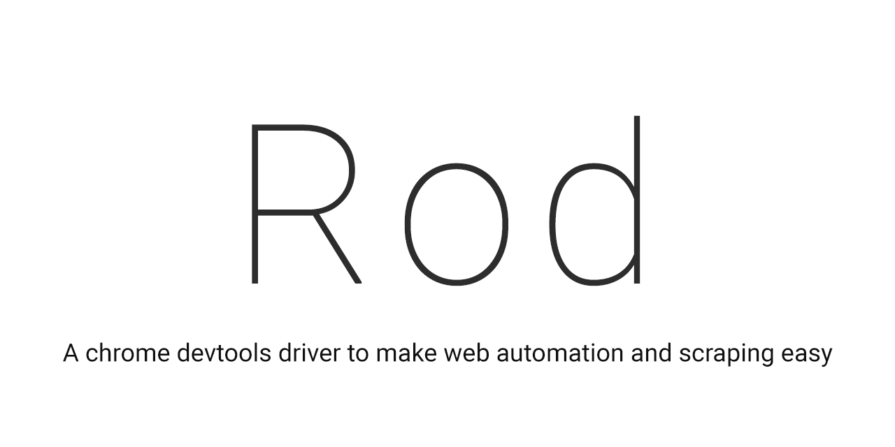

# Overview

[][discord room]

Rod is a High-level Devtools driver directly based on [DevTools Protocol](https://chromedevtools.github.io/devtools-protocol/).
It's designed for web automation and scraping. Rod also tries to expose low-level interfaces to users, so that whenever a function is missing users can easily send control requests to the browser directly.

## Features

- Fluent interface design to reduce verbose code
- Chained context design, intuitive to timeout or cancel the long-running task
- Debugging friendly, auto input tracing, remote monitoring headless browser
- Automatically find or download [browser](lib/launcher)
- No external dependencies, [CI](https://github.com/go-rod/rod/actions) tested on Linux, Mac, and Windows
- High-level helpers like WaitStable, WaitRequestIdle, HijackRequests, GetResource
- Two-step WaitEvent design, never miss an event
- Correctly handles nested iframes
- No zombie browser process after the crash ([how it works](https://github.com/ysmood/leakless))

## Examples

You can find examples from [here](examples_test.go) or [here](lib/examples).

For more detailed examples, please search the unit tests.
Such as the usage of method `HandleAuth`, you can search all the `*_test.go` files that contain `HandleAuth` or `HandleAuthE`,
for example, use Github online [search in repository](https://github.com/go-rod/rod/search?q=HandleAuth&unscoped_q=HandleAuth).
You can also search the GitHub issues, they contain a lot of usage examples too.

[Here](lib/examples/compare-chromedp) is a comparison of the examples between rod and chromedp.

If you have questions, please raise an issue or join the [chat room][discord room].

## How it works

Here's the common start process of Rod:

1. Try to connect to a Devtools endpoint (WebSocket), if not found try to launch a local browser, if still not found try to download one, then connect again. The lib to handle it is [launcher](lib/launcher).

1. Use the JSON-RPC to talk to the Devtools endpoint to control the browser. The lib handles it is [cdp](lib/cdp).

1. The type definitions of the JSON-RPC are in lib [proto](lib/proto).

1. To control a specific page, Rod will first inject a js helper script to it. Rod uses it to query and manipulate the page content. The js lib is in [assets](lib/assets).

## FAQ

### Q: How to use Rod with docker

To let rod work with docker is very easy:

1. Run the Rod image `docker run -p 9222:9222 rodorg/rod`

2. Open another terminal and run a go program like this [example](lib/examples/remote-launch/main.go)

The [Rod image](https://hub.docker.com/repository/docker/rodorg/rod)
can dynamically launch a browser for each remote driver with customizable browser flags.
It's [tuned](lib/docker/Dockerfile) for screenshots and fonts among popular natural languages.
You can easily load balance requests to the cluster of this image, each container can create multiple browser instances at the same time.

### Q: Why functions don't return error values

See the [E suffix](.github/CONTRIBUTING.md#e-suffix).

### Q: Why there is always an "about:blank" page

It's an issue of the browser itself. If we enable the `--no-first-run` flag and we don't create a blank page, it will create a hello page which will consume more power.

### Q: Does it support other browsers like Firefox or Edge

Rod should work with any browser that supports [DevTools Protocol](https://chromedevtools.github.io/devtools-protocol/).

- Microsoft Edge can pass all the unit tests.
- Firefox is [supporting](https://wiki.mozilla.org/Remote) this protocol.
- Safari doesn't have any plan to support it yet.
- IE won't support it.

### Q: Why is it called Rod

Rod is related to puppetry, see [Rod Puppet](https://en.wikipedia.org/wiki/Puppet#Rod_puppet).
So we are the puppeteer, the browser is the puppet, we use the rod to control the puppet.
So in this sense, `puppeteer.js` sounds strange, we are controlling a puppeteer?

### Q: How to contribute

Please check this [doc](.github/CONTRIBUTING.md).

### Q: How versioning is handled

[Semver](https://semver.org/) is used.

Before `v1.0.0` whenever the second section changed, such as `v0.1.0` to `v0.2.0`, there must be some public API changes, such as changes of function names or parameter types. If only the last section changed, no public API will be changed.

### Q: Why another puppeteer like lib

There are a lot of great projects, but no one is perfect, choose the best one that fits your needs is important.

- [selenium](https://www.selenium.dev/)

  It's slower by design because it encourages the use of hard-coded sleep. When work with Rod, you generally don't use sleep at all.
  Therefore it's more buggy to use selenium if the network is unstable.
  It's harder to setup and maintain because of extra dependencies like a browser driver.

- [puppeteer](https://github.com/puppeteer/puppeteer)

  With Puppeteer, you have to handle promise/async/await a lot. It requires a deep understanding of how promises works which are usually painful for QA to write automation tests. End to end tests usually requires a lot of sync operations to simulate human inputs, because Puppeteer is based on Nodejs all control signals it sends to the browser will be async calls, so it's unfriendly for QA from the beginning.

  Rod will only enable domain events when they are needed, puppeteer will always enable all the domains which will consume a lot of resources when driving a remote browser.

- [chromedp](https://github.com/chromedp/chromedp)

  With Chromedp, you have to use their verbose DSL like tasks to handle the main logic, because Chromedp uses several wrappers to handle execution with context and options which makes it very hard to understand their code when bugs happen. The DSL like wrapper also make the Go type useless when tracking issues.

  It's painful to use Chromedp to deal with iframes, this [ticket](https://github.com/chromedp/chromedp/issues/72) is still open after years.

  When a crash happens, Chromedp will leave the zombie browser process on Windows and Mac.

  For more comparison you can check [here](lib/examples/compare-chromedp). If you compare the `logic` example between [rod](lib/examples/compare-chromedp/logic/main.go) and [chromedp](https://github.com/chromedp/examples/blob/master/logic/main.go), you will find out how much simpler rod is. Besides, rod has more high-level helpers like WaitRequestIdle, GetDownloadFile, HijackRequests, etc.

- [cypress](https://www.cypress.io/)

  Cypress is very limited, for closed shadow dom or cross-domain iframes it's almost unusable. Read their [limitation doc](https://docs.cypress.io/guides/references/trade-offs.html) for more details.

[discord room]: https://discord.gg/CpevuvY
